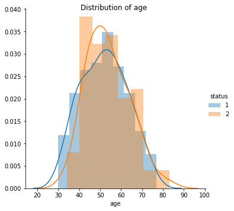
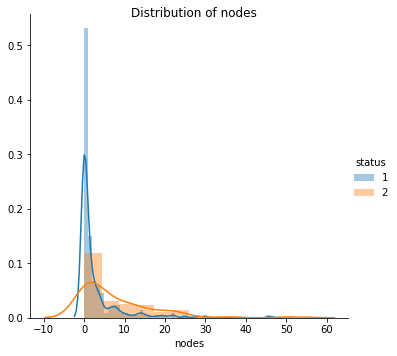
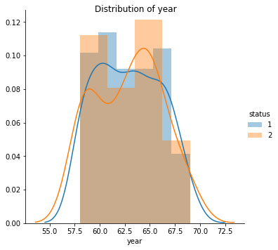
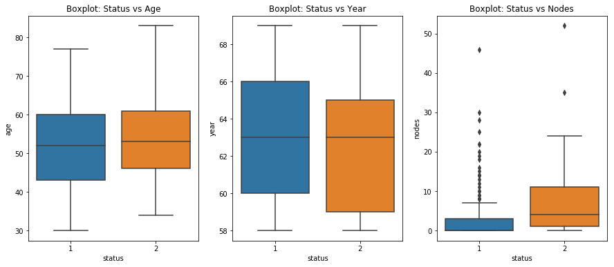
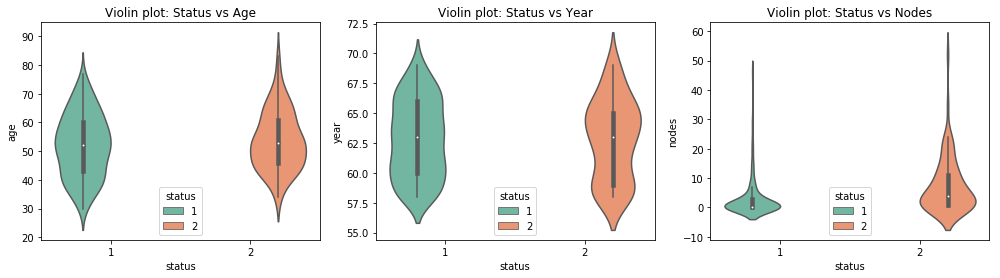
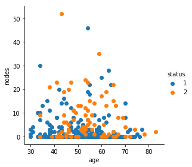
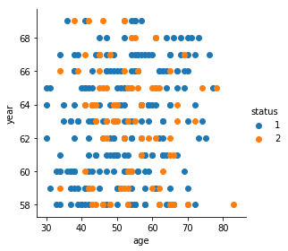
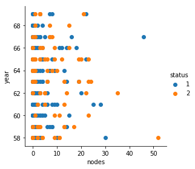
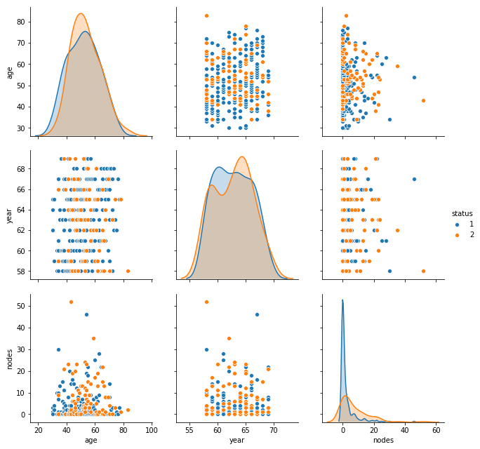

# Haberman 

# The data

Haberman data contains information from a study conducted between 1958 to 1969 of patients who has done surgery for breast cancer.

* The column, nodes, represents the number of auxillary nodes affected. Auxillary nodes are located in a person's armpits. 
More info on auxillay nodes and breast cancer: https://www.medicalnewstoday.com/articles/319713.php


```python
import numpy as np
import pandas as pd
import seaborn as sns
import matplotlib.pyplot as plt
import warnings
warnings.filterwarnings('ignore')

```


```python
haberman = pd.read_csv('haberman.csv')
survived = haberman[haberman.status == 1]
died = haberman[haberman.status == 2]

```


```python
print ('Number of rows: {}'.format(haberman.shape[0]))
print ('Number of columns: {}'.format(haberman.shape[1]))

```

    Number of rows: 306
    Number of columns: 4
    

* There are 306 observations and 4 variables

Let's look at few of the observations


```python
print ('*********** Top five observations ***********')
print (haberman.head())
print ('*********** Bottom five observations ***********')
print (haberman.tail())
```

    *********** Top five observations ***********
       age  year  nodes  status
    0   30    64      1       1
    1   30    62      3       1
    2   30    65      0       1
    3   31    59      2       1
    4   31    65      4       1
    *********** Bottom five observations ***********
         age  year  nodes  status
    301   75    62      1       1
    302   76    67      0       1
    303   77    65      3       1
    304   78    65      1       2
    305   83    58      2       2
    

* All the columns are numbers. However, we know that the status and years are categorical variables


```python
haberman.describe()

```


<div>
<style scoped>
    .dataframe tbody tr th:only-of-type {
        vertical-align: middle;
    }

    .dataframe tbody tr th {
        vertical-align: top;
    }

    .dataframe thead th {
        text-align: right;
    }
</style>
<table border="1" class="dataframe">
  <thead>
    <tr style="text-align: right;">
      <th></th>
      <th>age</th>
      <th>year</th>
      <th>nodes</th>
      <th>status</th>
    </tr>
  </thead>
  <tbody>
    <tr>
      <th>count</th>
      <td>306.000000</td>
      <td>306.000000</td>
      <td>306.000000</td>
      <td>306.000000</td>
    </tr>
    <tr>
      <th>mean</th>
      <td>52.457516</td>
      <td>62.852941</td>
      <td>4.026144</td>
      <td>1.264706</td>
    </tr>
    <tr>
      <th>std</th>
      <td>10.803452</td>
      <td>3.249405</td>
      <td>7.189654</td>
      <td>0.441899</td>
    </tr>
    <tr>
      <th>min</th>
      <td>30.000000</td>
      <td>58.000000</td>
      <td>0.000000</td>
      <td>1.000000</td>
    </tr>
    <tr>
      <th>25%</th>
      <td>44.000000</td>
      <td>60.000000</td>
      <td>0.000000</td>
      <td>1.000000</td>
    </tr>
    <tr>
      <th>50%</th>
      <td>52.000000</td>
      <td>63.000000</td>
      <td>1.000000</td>
      <td>1.000000</td>
    </tr>
    <tr>
      <th>75%</th>
      <td>60.750000</td>
      <td>65.750000</td>
      <td>4.000000</td>
      <td>2.000000</td>
    </tr>
    <tr>
      <th>max</th>
      <td>83.000000</td>
      <td>69.000000</td>
      <td>52.000000</td>
      <td>2.000000</td>
    </tr>
  </tbody>
</table>
</div>


* We have data of people who has done operation between 1958 and 1969 with age ranging from 30 to 83


```python
haberman['status'].value_counts()
```


    1    225
    2     81
    Name: status, dtype: int64


* Status 1 represents the patients survived 5 years of longer after the surgery and 2 represents the patients who died within 5 years of surgery

* In our data, there are 225 observations of survived patients and 81 of people who did not survive, implying an imbalanced dataset 

# Objective

There are 81 patients died within 5 years of the surgery, but 225 did not.

__Can we find the variables influencing the death of the patients using simple plotting techniques?__ 

Let's find out..! 


```python
#Extract feature column names
features = list(haberman.columns)
target = 'status'
features.remove(target)
print (features)

```

    ['age', 'year', 'nodes']
    

# Univariate Analysis

### Probability density function and cumulative density function 


```python
def plot_pdf_and_cdf(data, variable):
    counts, bin_edges = np.histogram(haberman[variable], bins=10, 
                                 density = False)
    pdf = counts/(sum(counts))
    cdf = np.cumsum(pdf)
    plt.plot(bin_edges[1:], pdf)
    plt.plot(bin_edges[1:], cdf)
    plt.title('{}: PDF and CDF '.format(variable.capitalize()))
    plt.xlabel(variable)
    
    
plt.figure(figsize=(15,5))
for index, feature in enumerate(features):
    plt.subplot(1,3, index+1)
    plot_pdf_and_cdf(haberman, feature)
```


### Findings:
* Most of the patients are aged below 70
* The year variable seems to be faily distributed across the years
* Around 81% of patients have less than 10 auxilary nodes detected 


```python
print ('**** Age **** \n 95th percentile:{} \n 99th percentile:{}'.format(np.percentile(haberman['age'],95),round(np.percentile(haberman['age'],99),2)))
print ('**** Nodes **** \n 95th percentile:{} \n 99th percentile:{}'.format(np.percentile(haberman['nodes'],95),round(np.percentile(haberman['nodes'],99),2)))
print ('**** Year **** \n 95th percentile:{} \n 99th percentile:{}'.format(np.percentile(haberman['year'],95),round(np.percentile(haberman['year'],99),2)))

```

    **** Age **** 
     95th percentile:70.0 
     99th percentile:75.95
    **** Nodes **** 
     95th percentile:19.75 
     99th percentile:29.9
    **** Year **** 
     95th percentile:68.0 
     99th percentile:69.0
    

### Findings

* 95 % of the patients are aged below 70 and 99% are aged below 76
* 99% of the patients have less than 30, implying that it is rare for for the breast cancer to spread to over 30 nodes

### Histogram and density plots


```python
def hist_density_plot(data, feature, target):
    sns.FacetGrid(data, hue=target, size=5).map(sns.distplot, feature) \
    .add_legend().fig.suptitle('Distribution of {}'.format(feature))

    
```


```python
hist_density_plot(haberman, 'age', 'status')
```





* From the distribution, age does not have much influence on the survival. 
* Also, ages range from 30 to 83 - no indication of outliers 


```python
print ('Mean age of the survived patients: {}'.format(round(np.mean(survived['age']), 2)))
print ('Mean age of the died patients: {}'.format(round(np.mean(died['age']), 2)))
```

    Mean age of the survived patients: 52.02
    Mean age of the died patients: 53.68
    

* Mean of both died and survived patients are close to each other, strengthening our conclusion that age does not influence on the survival


```python
plt.figure(figsize=(1,1))
hist_density_plot(haberman, 'nodes', 'status')
```


    <Figure size 72x72 with 0 Axes>





* The nodes' spread of died patients seems to be wide. Let's look at the mean values


```python
print ('Mean nodes of the survived patients: {}'.format(round(np.mean(survived['nodes']), 2)))
print ('Mean nodes of the died patients: {}'.format(round(np.mean(died['nodes']), 2)))
```

    Mean nodes of the survived patients: 2.79
    Mean nodes of the died patients: 7.46
    

* There is a noticable difference between the averages nodes of the survived and of the dead. However, from the distribution, it is clear that there are outliers in the data


```python
hist_density_plot(haberman, 'year', 'status')
```





* As we already know, the dataset contains observations from 1958 and 1969
* The data seems to be fairly distributed with peaks at certain periods. However, the influence on the target variable is unclear from the plot 

### Box plots


```python
def box_plot(data, x, y, ax):
    sns.boxplot(x=x, y=y, data=data, ax = ax).set_title('Boxplot: {} vs {}'.format(x.capitalize(),y.capitalize()))
    #plt.show()

    
```


```python
fig, axes = plt.subplots(1, 3, figsize=(15, 6))
for index, feature in enumerate(features):
    box_plot(data = haberman, x = 'status', y = feature, ax = axes[index])
plt.show()
```





* Age is neatly distributed with no outliers. Both survived and died patients have a similar average age
* The year variable does not have any outliers and does not seem to influence the survival chance
* As seen earlier, there are few outliers in the nodes variable


```python
print ('Median nodes of the survived patients: {}'.format(round(np.median(survived['nodes']), 4)))
print ('Median nodes of the died patients: {}'.format(round(np.median(died['nodes']), 4)))
```

    Median nodes of the survived patients: 0.0
    Median nodes of the died patients: 4.0
    

* The median of number of nodes is significantly different between the survived and the dead, indicating influence of number of nodes on the survival of patients

### Violin plots


```python
def violin_plot(data,target, y, palette, ax):
    sns.violinplot(x= target, y= y, data=haberman, size=8, hue = target, palette= palette, ax = ax) \
    .set_title('Violin plot: {} vs {}'.format(target.capitalize(),y.capitalize()))
    plt.legend(title = 'status',  loc = 'lower center')
```


```python
fig, axes = plt.subplots(1, 3, figsize=(17, 4))
for index, feature in enumerate(features):
    violin_plot(data = haberman, target = 'status', y = feature, palette = 'Set2',ax = axes[index])
plt.show()
```

    No handles with labels found to put in legend.
    No handles with labels found to put in legend.
    





* Age and Year does not have any influence on our target variable
* Number of auxilary nodes affected seems to the influence on our target variable

# Bivariate analysis

### Age and Nodes 


```python
sns.FacetGrid(haberman, hue="status", size=4) \
   .map(plt.scatter, "age", "nodes") \
   .add_legend();
plt.show();

```





* We cannot linearly seperate our class using nodes and ages

### Age and Year


```python
sns.FacetGrid(haberman, hue="status", size=4) \
   .map(plt.scatter, "age", "year") \
   .add_legend();
plt.show();

```





* We cannot linearly seperate our class using nodes and year

### Nodes and Year


```python
sns.FacetGrid(haberman, hue="status", size=4) \
   .map(plt.scatter, "nodes", "year") \
   .add_legend();
plt.show();

```





* We cannot linearly seperate our class using nodes and year
* It is difficult to linearly seperate the target class from the above plots

### Pair plot


```python
sns.pairplot(haberman, hue="status", size=3, vars = features);
plt.show()
#plt.close()
```





* None of the plots helps us in seperating the target class as there is plenty of overlap 

# Conclusions

* The number of auxillary nodes detected affects the survival chance 
* Age and year of surgery do not affect the survival chance

